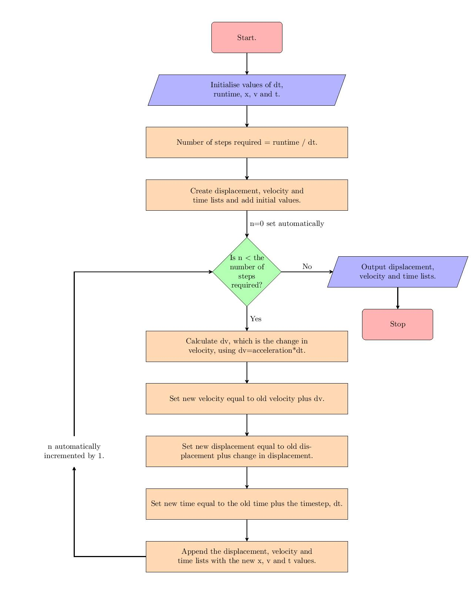

# Materials Science Materials Modeling

This repository focuses on **Materials Science** and its application in **modeling mechanical systems** like pendulums and shock absorbers. It includes algorithms, images, and Python code to simulate and visualize various physical systems, providing insights into their behavior through computational methods.

## Table of Contents

1. [Introduction](#introduction)
2. [Pendulum System Modeling](#pendulum-system-modeling)
3. [Shock Absorber System](#shock-absorber-system)
4. [Flowchart and Algorithm](#flowchart-and-algorithm)
5. [Files in the Repository](#files-in-the-repository)
6. [Getting Started](#getting-started)
7. [Installation](#installation)
8. [Contributing](#contributing)
9. [License](#license)

---

## Introduction

This repository showcases **Materials Science** modeling for mechanical systems like **pendulums** and **shock absorbers**. By leveraging computational tools such as Python, we can simulate their motion and predict their physical behavior under different conditions. The repository includes:
- **Pendulum system analysis**: Simulating pendulum motion and forces.
- **Shock absorber modeling**: Exploring the behavior of damped oscillations in mechanical systems.
- **Flowcharts**: Algorithm visualizations to represent system processes.

## Pendulum System Modeling

The pendulum is a classic example used in physics to demonstrate simple harmonic motion. This repository includes detailed visualizations and simulations of pendulum motion, including forces acting on the pendulum at different points in its swing.


Explore the simulations in the provided Jupyter Notebook file: [Materials Modeling for Materials Science.ipynb](./Materials Modeling for Materials Science.ipynb).

## Shock Absorber System

The **shock absorber** system models the damping and oscillation behavior of mechanical systems. The repository includes a visual representation of a shock absorber, as well as computational methods for simulating its damped motion.


The system helps understand how mechanical energy is dissipated and how damping affects oscillations in real-world systems, such as vehicle suspension.

## Flowchart and Algorithm

The algorithm and flowchart provided in this repository visually represent the process for simulating motion, such as in the pendulum system. It outlines the steps involved in computing displacement, velocity, and acceleration over time.



This flowchart is a helpful guide for understanding the computational workflow used in the simulations.

## Files in the Repository

- **`Materials Modeling for Materials Science.ipynb`**: A Jupyter notebook containing Python code for simulating pendulum motion and shock absorber systems.
- **`F_pendulum1.jpg` and `F_pendulum2.jpg`**: Images of pendulum forces.
- **`shock_absorber.jpg`**: A visual representation of a shock absorber.
- **`alg1.jpg`**: A flowchart outlining the steps in the algorithm for simulating mechanical systems.

## Getting Started

### Prerequisites

You will need the following software and libraries to run the simulations and visualizations:
- Python 3.x
- NumPy for numerical calculations
- Matplotlib for data visualization
- Jupyter Notebook (optional, for running the provided `.ipynb` files)

### Installation

1. Clone the repository:

   ```bash
   git clone https://github.com/smahala02/Materials-Science-Materials-Modeling.git
   ```

2. Install the required Python libraries:

   ```bash
   pip install numpy matplotlib
   ```

3. Open the Jupyter notebook to explore the simulations:

   ```bash
   jupyter notebook 'Materials Modeling for Materials Science.ipynb'
   ```

## Contributing

Contributions to this repository are welcome! If you have ideas for new simulations or improvements to the existing models, feel free to submit a pull request.

1. Fork the repository.
2. Create a new branch (`git checkout -b new-feature`).
3. Commit your changes (`git commit -m 'Add new feature'`).
4. Push to the branch (`git push origin new-feature`).
5. Open a pull request.

## License

This repository is licensed under the MIT License. See the `LICENSE` file for more information.

## Author
- [smahala02](https://github.com/smahala02)

